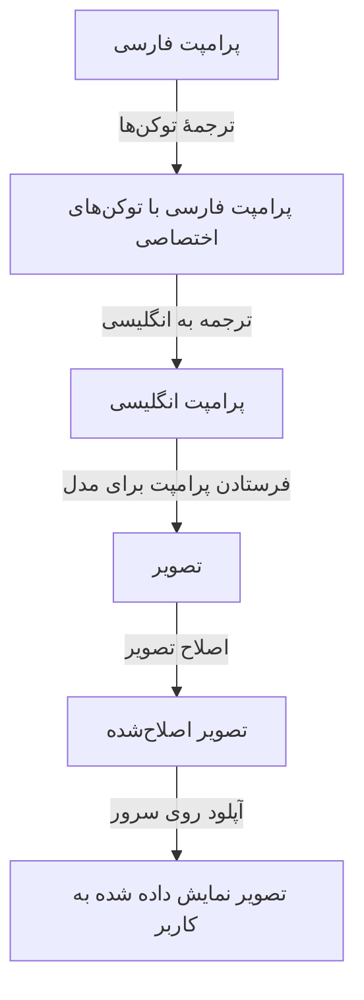

در این متن روندی برای رسیدن به تصویر از پرامپت زبان فارسی ارائه می‌شود.

## مدل کلی مراحل



## گام صفرم: ترجمهٔ توکن‌های خاص [اختیاری]

اگر بناست از مدل‌های Fine-Tune شده بر روی شخصیت یا سبک‌های خاص استفاده کنیم، بهتر است قبل از ترجمهٔ دستور، توکن‌های مخصوص آن را در متن فارسی جاگذاری کنیم. مثلاً کد زیر برای دستورهای فارسی حاوی اسامی شهید چمران، توکن `chamran` را جاگذاری می‌کند.

```python title="prompt_preprocessor.py"
import re

input_prompt = "مصطفی چمران در حال نگاه به غروب آفتاب در میانهٔ صحرا"

def replace_keywords(text, keyword_map):
    # Sort the keys by length in descending order to handle longer matches first
    sorted_keywords = sorted(keyword_map.keys(), key=len, reverse=True)
    
    # Create a regex pattern that matches any of the keywords
    pattern = re.compile(r'\b(?:' + '|'.join(map(re.escape, sorted_keywords)) + r')\b')
    
    # Function to replace a matched keyword with its corresponding token
    def replacer(match):
        return keyword_map[match.group(0)]
    
    # Perform the substitution
    return pattern.sub(replacer, text)

# Define the keyword mapping
keyword_map = {
    "مصطفی چمران ساوه‌ای": "chamran",
    "شهید مصطفی چمران": "chamran",
    "مصطفی چمران": "chamran",
    "شهید چمران": "chamran",
    "چمران": "chamran",
}

result = replace_keywords(input_prompt, keyword_map)
print(result)
```

ورودی:

```
مصطفی چمران در حال نگاه به غروب آفتاب در میانهٔ صحرا
```

خروجی:

```
chamran در حال نگاه به غروب آفتاب در میانهٔ صحرا
```

## گام اول: ترجمهٔ پرامپت به زبان انگلیسی

برای ترجمه به انگلیسی از سرویس [one-api](https://docs.one-api.ir/translate#/Text%20Translators/post_google_) استفاده می‌کنیم. دقت داشته باشید که برای اجرای این کد، باید در سایت one-api ثبت‌نام کرده و یک توکن برای استفاده از سرویس رایگان ترجمه تهیه کنید.

```python title="prompt_translator.py"
import requests

def translate_text(text):
    url = "https://api.one-api.ir/translate/v1/google/"
    headers = {
        "Content-Type": "application/json",
        "one-api-token": "@@@@@@@@@@@@@@@@@@"
    }
    data = {
        "source": "fa",
        "target": "en",
        "text": text
    }
    response = requests.post(url, headers=headers, json=data)
    if response.status_code == 200:
        return response.json()['result']
    else:
        return {"error": "Failed to translate text"}

result = translate_text(result)
print(result)
```

ورودی:

```
chamran در حال نگاه به غروب آفتاب در میانهٔ صحرا
```

خروجی:

```
Chamran looking at the sunset in the middle of the desert
```

## گام دوم: فرستادن پرامپت برای تولید عکس

در این گام مشابه آنچه در ضمیمهٔ متن [[مدل‌سازی و چهره‌پردازی با Flux#ضمیمه ۲ بهینه‌سازی برای کاربران عادی|مدل‌سازی با Flux]] گفتیم، پرامپت را برای سرور Replicate ارسال می‌کنیم تا تصویر را برای ما بسازد.

‍‍‍
```python title="image_gen.py"
import replicate

input = {
    "prompt": result,
    "hf_lora": "Eledah/flux-lora-character-chamran",
    "lora_scale": 0.9,
    "num_outputs": 4,
    "aspect_ratio": "16:9",
    "output_format": "png",
    "guidance_scale": 3.5,
    "output_quality": 80,
    "num_inference_steps": 28
}

output = replicate.run(
    "lucataco/flux-dev-lora:a22c463f11808638ad5e2ebd582e07a469031f48dd567366fb4c6fdab91d614d",
    input=input
)

print(output)
```

ورودی:

```
Chamran looking at the sunset in the middle of the desert
```

خروجی:

![[chamran-4.jpg]]

## گام سوم: اصلاح تصاویر تولید شده [اختیاری]

گاهی از اوقات خروجی مدل‌های موجود در چهره‌پردازی، رعایت جزئیات یا تولید یک تصویر شفاف ناتوان هستند. برای حل این مشکلات مدل‌هایی اختصاصی مثل [codeformer](https://replicate.com/sczhou/codeformer) یا [gfpgan](https://replicate.com/tencentarc/gfpgan) یا [real-esrgan](https://replicate.com/nightmareai/real-esrgan) توسعه یافته‌اند که کیفیت چهره‌ها و اندازهٔ عکس را بالا می‌برند. می‌شود پس از دریافت عکس‌ها و محض محکم‌کاری، یک دور عکس خروجی را برای این مدل‌ها فرستاد تا کیفیت خروجی بالاتر رود. مثلاً تصویر زیر با کمک مدل real-esrgran بهینه‌سازی شده است.

```python title="image_upscaler.py"
input = {
	"image": img_url,
	"scale": 4,
	"face_enhance": False
}

output = replicate.run(
	"nightmareai/real-esrgan:f121d640bd286e1fdc67f9799164c1d5be36ff74576ee11c803ae5b665dd46aa",
	input=input
)
    
print(output)
```

ورودی و خروجی:

<iframe width="100%" height="520px" src="https://eledah.github.io/quartz_blog/attachment/before-after-slider-chamran.html"></iframe>

## گام چهارم: آپلود و نمایش به کاربر [اختیاری]

به دلیل عدم دسترسی کاربران ایرانی به دامنهٔ `replicate.delivery`، عکس‌های تولید شده بدون فیلترشکن قابل مشاهده یا دانلود نیستند. در این حالت می‌شود از هاست‌های خارجی -یا هاست‌های داخلی متصل به DNSهای دورزنندهٔ تحریم- برای دانلود و آپلود دوبارهٔ عکس‌ها استفاده کرد.

```python
s3_client = boto3.client(
    "s3",
    endpoint_url=LIARA_ENDPOINT,
    aws_access_key_id=LIARA_ACCESS_KEY,
    aws_secret_access_key=LIARA_SECRET_KEY,
)

def download_and_upload_to_s3(image_url):
    try:
        response = requests.get(image_url)
        image_content = BytesIO(response.content)

        filename = f"image_{datetime.now().strftime('%Y%m%d%H%M%S')}_{os.urandom(4).hex()}.png"

        s3_client.upload_fileobj(image_content, LIARA_BUCKET_NAME, filename)
        s3_url = f"{LIARA_ENDPOINT}/{LIARA_BUCKET_NAME}/{filename}"

        return s3_url
    except Exception as e:
        app.logger.error(f"Error processing image: {str(e)}")
        return None

```